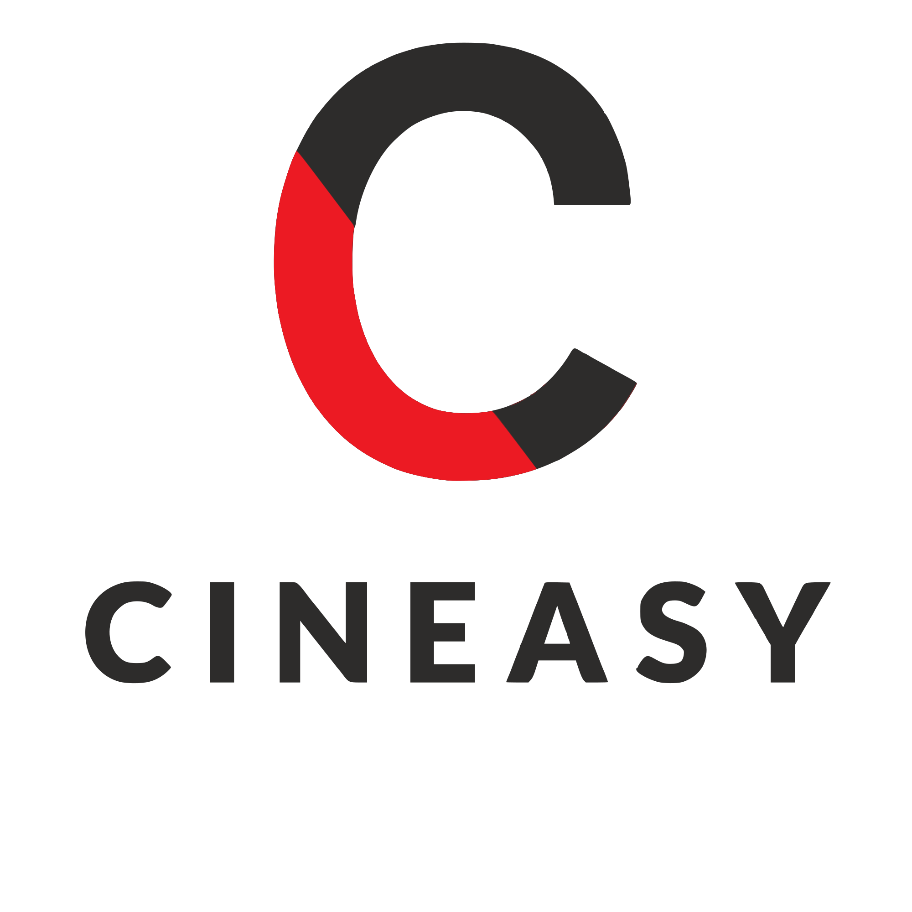
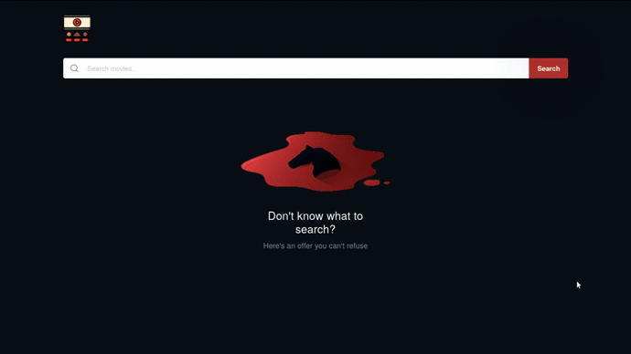

<div align="center" style="margin-bottom: 20px;">

</div>

<div align="center" style="margin: 20px;">

[](http://github.com/jvictorfarias/cineasy/LICENSE.md)


<p align="center" >
  <a href="#fire-prévia-da-aplicação"> :fire: Prévia da Aplicação</a> |
  <a href="#rocket-tecnologias-usadas"> :rocket: Tecnologias Usadas</a> |
  <a href="#hammer-deploy-da-aplicação"> :hammer: Deploy da Aplicação</a> |
  <a href="#thinking-como-contribuir?"> :thinking: Como Contribuir?</a> |
  <a href="#zap-executando-o-projeto"> :zap: Executando o Projeto </a> |
</p>

</div>

## :movie_camera: O projeto(Em desenvolvimento)

Aplicação para realizar uma listagem de filmes baseada na busca do usuário, onde
ele pode favoritar os filmes e visualizar na ordem de nota no IMDb ou títulos mais recentes.
A motivação de iniciar esse projeto, foi resolver o desafio Full-Stack do Instituto Atlântico,
a fim de colocar em prática os conhecimentos obtidos.

## :fire: Prévia da Aplicação

<div align="center"> 

</div>

### :rocket: Tecnologias Usadas

O projeto foi feito com as seguintes tecnologias:

- [NodeJS](https://nodejs.org/en/)
- [ReactJS](https://pt-br.reactjs.org/)
- [ExpressJS](https://expressjs.com/pt-br/)
- [JWT](https://jwt.io/)
- [Yup](https://github.com/jquense/yup)
- [Styled-Components](https://styled-components.com/)
- [TypeScript](https://www.typescriptlang.org/)
- [OMDb-API](http://www.omdbapi.com/)
- [React-Icons](https://react-icons.github.io/react-icons/)
{...}

## :hammer: Deploy da Aplicação
{...}


## :thinking: Como Contribuir?
**Faça um fork deste repositório**

```bash
# Clone o seu fork
$ git clone url-do-seu-fork && cd cineasy

# Crie uma branch com sua feature ou correção de bugs
$ git checkout -b minha-branch

# Faça o commit das suas alterações
$ git commit -m 'feature/bugfix: minhas alterações'

# Faça o push para a sua branch
$ git push origin minha-branch
```

Depois que o merge da sua pull request for feito, você pode deletar a sua branch.

## :zap: Executando o Projeto
#### Clonando o projeto
```sh
$ git clone https://github.com/jvictorfarias/cineasy.git
$ cd cineasy
```
#### Iniciando a API
```sh
$ cd api
$ yarn && yarn dev:server
```

#### Iniciando o Frontend
```sh
$ cd web
$ yarn && yarn start
```

### :memo: Licença

Este projeto é desenvolvido sob a licença MIT. Veja o arquivo [LICENSE](LICENSE.md) para saber mais detalhes.

<p align="center" style="margin-top: 20px; border-top: 1px solid #eee; padding-top: 20px;">Feito com :purple_heart: by <strong> Joao Victor Farias</strong> </p>